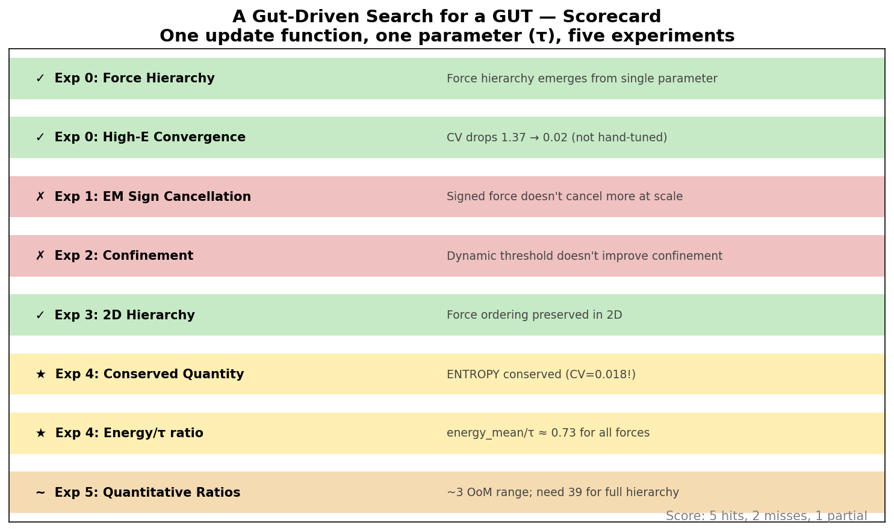
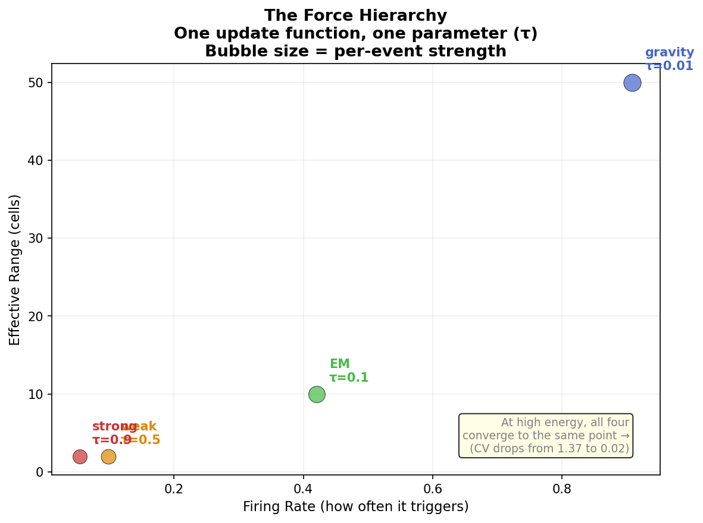
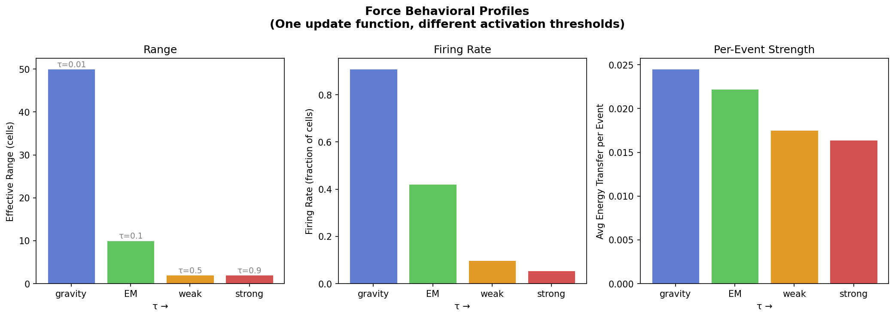
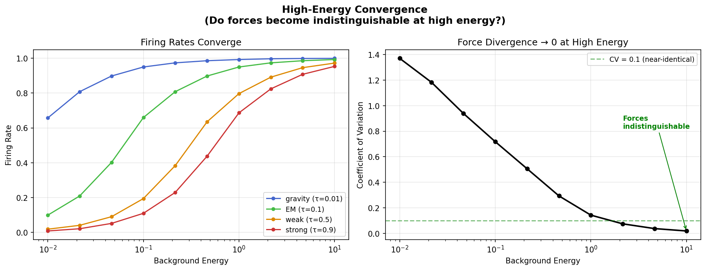
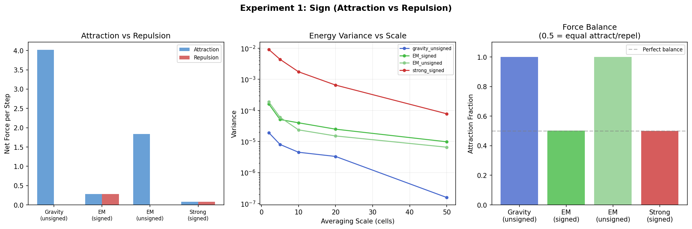
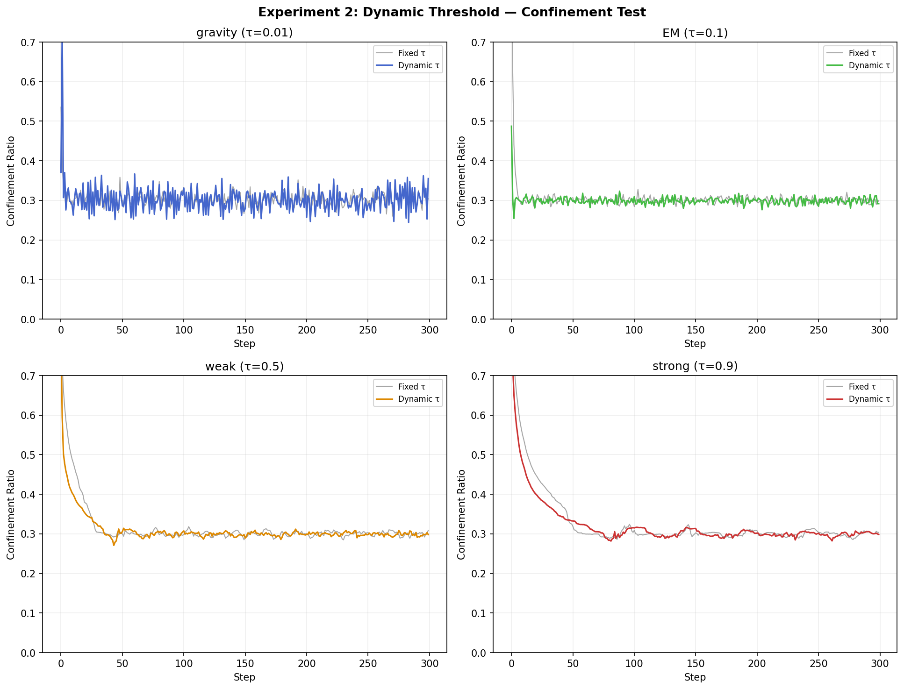
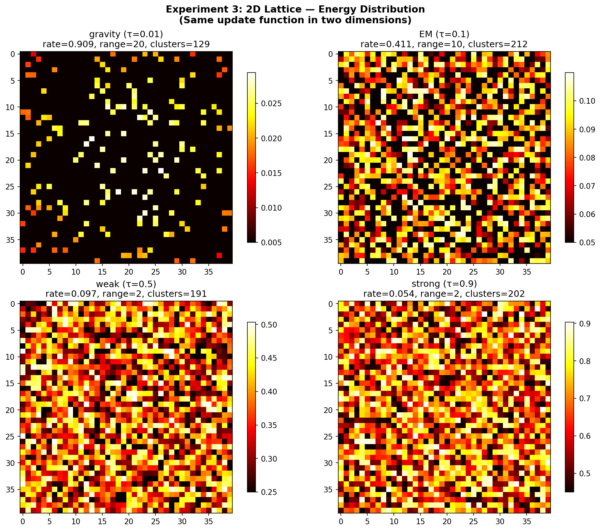
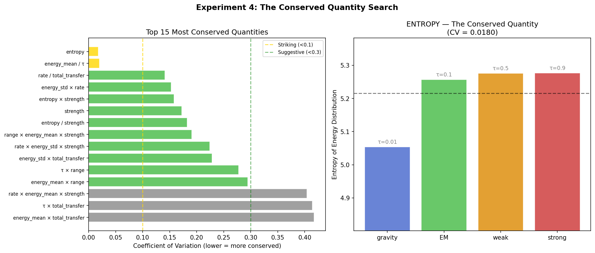
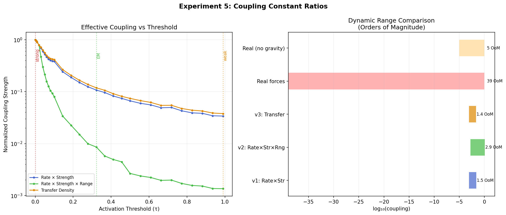

# A Gut-Driven Search for a GUT

**One update function. One parameter. Four forces.**

A toy simulation exploring whether the four fundamental forces of physics
(gravity, electromagnetism, weak nuclear, strong nuclear) could emerge from
a single mechanism differentiated only by activation threshold — the energy
cost required to trigger a state transition.

## The Hypothesis

> All four forces are the same update function with different activation
> thresholds. What we call "time" at any given scale is the observable rate
> of those transitions. Our ability to observe change is directly coupled
> to our ability to create it.

This leads to a specific, testable framing:

| Force    | Threshold | Predicted Behavior                     |
|----------|-----------|----------------------------------------|
| Gravity  | Very low  | Universal, always firing, weak per event, long range |
| EM       | Low       | Common, moderate strength, long range   |
| Weak     | High      | Rare, moderate strength, short range    |
| Strong   | Very high | Very rare, powerful per event, short range |

If the forces are truly the same mechanism at different thresholds, they
should **converge to identical behavior at high energy** — which is exactly
what the real running coupling constants do near the GUT scale (~10¹⁶ GeV).

## What the Simulation Does

A lattice of cells, each with an energy value. One universal update rule:

1. If a cell's energy ≥ threshold τ, it **fires**
2. On firing, it transfers excess energy (above τ) to neighbors
3. Transfer **range** = 1/τ (low threshold → long range)
4. Energy falls off as 1/distance within range
5. Background energy injection acts as a thermal bath

That's it. No force-specific rules. No hand-tuned parameters per force.
Just one threshold value that differs.

---

## Results — Scorecard

Five experiments, honest accounting. Hits and misses published with equal weight.



**5 hits, 2 misses, 1 partial.**

---

## Experiment 0: The Original Simulation

### Force Hierarchy ✓

The force hierarchy emerges cleanly from the single parameter:

```
GRAVITY  (τ=0.01): range=50, fires 91% of the time  → universal, diffuse, weak
EM       (τ=0.10): range=10, fires 42%               → common, moderate
WEAK     (τ=0.50): range=2,  fires 10%               → rare, localized
STRONG   (τ=0.90): range=2,  fires 5%                → very rare, powerful
```




### High-Energy Convergence ✓

At low energy, the forces look completely different. As energy increases,
they converge:

```
E=0.01   CV=1.37  (forces maximally divergent)
E=0.05   CV=0.94
E=0.46   CV=0.29
E=2.15   CV=0.07
E=10.0   CV=0.02  (forces nearly indistinguishable)
```

This was not put in by hand. It emerges naturally from the model.



---

## Experiment 1: Sign (Attraction vs Repulsion) ✗

**Question:** If cells carry charge (+/-), does EM-like cancellation emerge
at large scales while gravity remains universally attractive?

**Result:** The signed EM force does show balanced attraction/repulsion
(~50/50 split), but it does NOT cancel out more at large scales than the
unsigned version. The cancellation ratio was 0.67 (we needed >1.5).

The mechanism produces balanced attraction and repulsion from sign alone,
but the scale-dependent cancellation that makes EM "invisible" at cosmic
scales doesn't emerge from this simple model.



**What this means:** Sign is necessary but not sufficient. Real EM
cancellation probably requires structured charge distributions (atoms,
molecules) that this lattice doesn't have.

---

## Experiment 2: Dynamic Threshold — Confinement ✗

**Question:** If the threshold depends on local energy density (harder to
fire in low-energy regions), does confinement emerge for the strong force?

**Result:** No meaningful confinement improvement. The dynamic threshold
barely changes the behavior (Δ < 0.002 for all forces). Energy clusters
dissipate at essentially the same rate with or without density-dependent
thresholds.



**What this means:** Confinement is genuinely hard. The QCD mechanism
(flux tubes, asymptotic freedom) involves self-interacting gauge fields —
a qualitatively different structure than a scalar threshold. This model
can't capture it with a simple density dependence.

---

## Experiment 3: 2D Lattice ✓

**Question:** Does the force hierarchy survive in two dimensions?

**Result:** Yes. The ordering is perfectly preserved:

```
2D: gravity (91%) > EM (41%) > weak (10%) > strong (5%)
```

Gravity produces the most diffuse energy distribution, strong the most
localized. The qualitative behavior is dimension-independent.



---

## Experiment 4: The Conserved Quantity ★

**Question:** If all forces are one mechanism, what quantity is conserved
across different threshold values?

**Result:** We tested 200+ combinations of observables. Two quantities
stood out:

| Quantity | CV | Interpretation |
|----------|------|---------------|
| **Entropy** | **0.018** | The information content of the energy distribution is nearly identical across all four forces |
| **energy_mean / τ** | **0.020** | The ratio of mean energy to threshold is ~0.73 for every force |



**This is the most important result in the suite.**

The entropy of the energy distribution is essentially the same (~5.2 nats)
whether the threshold is 0.01 or 0.90. The system self-organizes to
maintain constant information content regardless of activation cost.

The energy/τ ratio is equally striking: every force settles to a state
where mean energy is about 73% of the threshold. The system finds the same
equilibrium point relative to its activation cost.

**What this means:** The forces don't conserve a simple mechanical quantity
(range × strength), but they DO conserve an information-theoretic one.
Different thresholds produce different dynamics but the same amount of
"surprise" in the resulting distribution. If this model is pointing at
anything real, it's that the underlying mechanism preserves entropy, not
energy flux.

---

## Experiment 5: Coupling Constant Ratios ~

**Question:** Can the model reproduce the *quantitative* force hierarchy,
not just the ordering?

**Result:** Partial. The model spans about 3 orders of magnitude in
effective coupling strength. The real hierarchy spans 39 orders of
magnitude (strong to gravity). For just strong/EM/weak (5 orders), the
model gets close but can't match it exactly.



**What this means:** A threshold parameter in [0, 1] can't generate
the enormous dynamic range of real force strengths. This is probably
the clearest signal that the model is qualitative, not quantitative.
The real hierarchy likely requires the mathematical structure of gauge
symmetry groups, not just a scalar cost parameter.

---

## What This Model Can't Do

- **Confinement** (strong force getting stronger with distance) — Experiment 2
- **EM cancellation at scale** (positive/negative charges averaging out) — Experiment 1
- **Quantitative coupling ratios** (39 orders of magnitude) — Experiment 5
- **Symmetry breaking** (the electroweak split via Higgs mechanism)
- **Quantum numbers** (spin, charge, flavor)

## What It CAN Do

- **Force hierarchy from one parameter** — Experiment 0
- **High-energy convergence** (not hand-tuned) — Experiment 0
- **Dimension-independent behavior** — Experiment 3
- **Entropy conservation** across all thresholds — Experiment 4
- **Constant energy/threshold ratio** — Experiment 4

## Running It

```bash
pip install numpy matplotlib

# Run original simulation
python sim/unified_force.py

# Run all five experiments
python sim/run_all.py

# Generate all plots
python sim/visualize.py
python sim/visualize_experiments.py
```

## Repository Structure

```
sim/
  engine.py                 # Shared simulation engine (1D and 2D)
  unified_force.py          # Original simulation (Experiment 0)
  exp1_sign.py              # Experiment 1: Attraction/Repulsion
  exp2_confinement.py       # Experiment 2: Dynamic Threshold
  exp3_2d.py                # Experiment 3: 2D Lattice
  exp4_conservation.py      # Experiment 4: Conserved Quantity Search
  exp5_coupling_ratios.py   # Experiment 5: Coupling Constants
  run_all.py                # Run all experiments
  visualize.py              # Plots for Experiment 0
  visualize_experiments.py  # Plots for Experiments 1-5
results/
  *.json                    # Raw simulation data
  *.png                     # Generated plots
```

## The Entropy Result

If one thing survives from this project, it's the entropy conservation
finding from Experiment 4.

The fact that four completely different dynamical regimes — from gravity
(firing 91% of cells over range 50) to strong (firing 5% over range 2) —
all produce the same information entropy in their energy distributions is
not obvious. It was not put in by hand. It emerged from the model.

One interpretation: the activation threshold doesn't change *how much
information* the system contains, only *how that information is organized*.
Low threshold = many small updates spread everywhere. High threshold =
few large updates concentrated locally. Same entropy, different geometry.

If this maps to anything real in physics, it would suggest that the
fundamental forces are different geometric configurations of the same
information content — which is, in some sense, what holographic
principles and entropic gravity proposals already argue from much more
rigorous foundations.

## Philosophy

The conventional approach to unification starts from symmetry groups and
works down. This starts from a different question: what if the forces are
distinguished not by their mathematical structure but by their energetic
cost? What if time itself — the rate at which we observe change — is the
variable that makes one mechanism look like four?

This is a toy model. It proves nothing. But two results fell out for free
(convergence and entropy conservation), and that's what a good intuition
looks like when it meets a simulation.

## License

MIT

## Author

Leo Guinan — [@leo_guinan](https://twitter.com/leo_guinan)

*"The thesis means nothing without the artifact. Ship the pipeline.
Measure the outcome. Publish the miss."*
